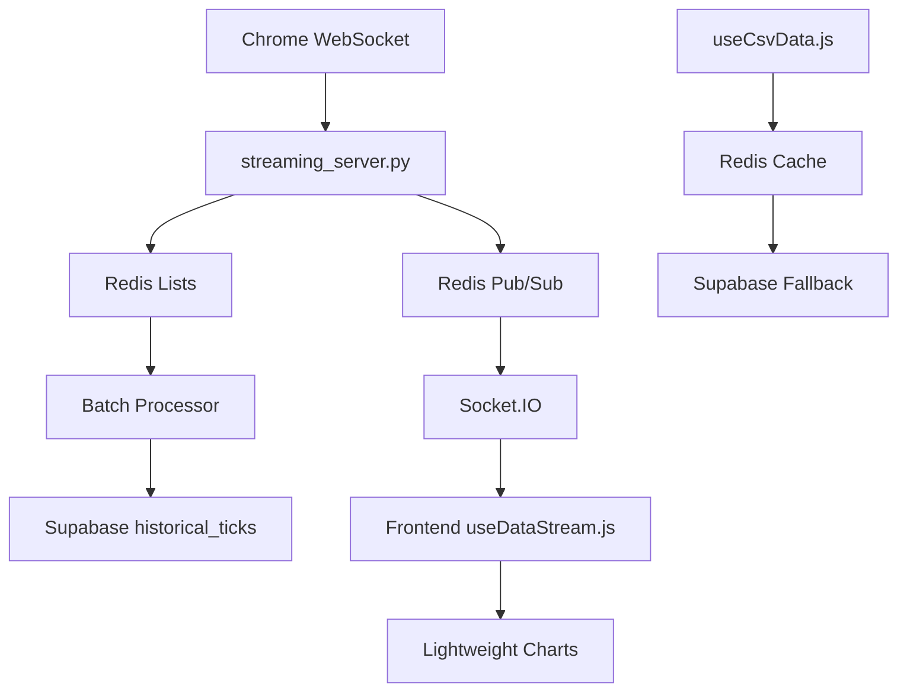

# Redis Integration Architecture Plan for QuFLX Trading Platform

## Executive Summary

This document outlines the comprehensive architecture for integrating Redis into the QuFLX trading platform to enhance real-time data streaming and historical data caching capabilities. The implementation will replace the current Map-based buffer in `useDataStream.js` with Redis pub/sub, add a caching layer for historical data, and maintain Supabase for persistent tick storage.

## Key Principles

✅ **Functional Simplicity** - Clear, focused Redis integration with minimal complexity
✅ **Sequential Logic** - Build data flow progressively from WebSocket to Redis to Frontend
✅ **Zero Assumptions** - Explicit error handling and connection management
✅ **Code Integrity** - Backward compatible, no breaking changes to existing API
✅ **Separation of Concerns** - Modular Redis logic for easy maintenance and future scaling
✅ **PowerShell Commands** - Use PowerShell for Windows-specific setup and testing

## Architecture Overview



## Data Flow Architecture

### 1. Real-Time Tick Processing
```
WebSocket → streaming_server.py → Redis List (ticks:ASSET_otc) → Redis Pub/Sub → Socket.IO → Frontend
```

### 2. Historical Data Caching
```
Supabase Query → Redis Cache (historical:ASSET_otc:1M) → Frontend (TTL: 1 hour)
```

### 3. Batch Persistence
```
Redis Lists → Batch Processor (30s intervals) → Supabase historical_ticks table
```

## Implementation Components

### Backend Components

#### 1. Redis Integration Module (`capabilities/redis_integration.py`)
- Redis connection management
- Pub/sub channel handling
- List operations for tick buffering
- Cache operations for historical data
- Error handling and reconnection logic

#### 2. Modified Streaming Server (`streaming_server.py`)
- Redis integration for real-time data
- Batch processing for Supabase persistence
- Historical data caching
- Asset-specific Redis key management

#### 3. Batch Processor (`capabilities/redis_batch_processor.py`)
- 30-second interval batch processing
- Redis to Supabase data transfer
- Duplicate detection and handling
- Error recovery and retry logic

### Frontend Components

#### 1. Modified Data Stream Hook (`gui/Data-Visualizer-React/src/hooks/useDataStream.js`)
- Replace Map-based buffer with Redis pub/sub
- Socket.IO event handling for Redis updates
- Maintain requestAnimationFrame for smooth rendering
- Error handling for Redis connection issues

#### 2. Enhanced CSV Data Hook (`gui/Data-Visualizer-React/src/hooks/useCsvData.js`)
- Redis cache checking before Supabase queries
- Fallback to Supabase on cache miss
- Cache invalidation and refresh logic

#### 3. Redis Client Integration
- Node.js Redis client for pub/sub
- Connection management and error handling
- Performance monitoring and logging

### Database Components

#### 1. Historical Ticks Table (Supabase)
```sql
CREATE TABLE IF NOT EXISTS historical_ticks (
    id BIGSERIAL PRIMARY KEY,
    pair VARCHAR(20) NOT NULL,        -- e.g., 'EURUSD_otc'
    price DECIMAL(20,10) NOT NULL,    -- Tick price
    timestamp BIGINT NOT NULL,        -- Unix timestamp
    created_at TIMESTAMP WITH TIME ZONE DEFAULT NOW()
);
```

#### 2. Indexes for Performance
```sql
CREATE INDEX IF NOT EXISTS idx_historical_ticks_pair_timestamp 
    ON historical_ticks (pair, timestamp DESC);

CREATE INDEX IF NOT EXISTS idx_historical_ticks_timestamp 
    ON historical_ticks (timestamp DESC);
```

## Redis Data Structure Design

### 1. Real-Time Tick Lists
- **Key Pattern**: `ticks:{ASSET_otc}`
- **Data Type**: List
- **Max Size**: 1000 entries
- **Operations**: LPUSH, LTRIM, LRANGE, DEL

### 2. Pub/Sub Channels
- **Channel Pattern**: `updates:{ASSET_otc}`
- **Data Type**: Pub/Sub Channel
- **Message Format**: JSON tick data

### 3. Historical Data Cache
- **Key Pattern**: `historical:{ASSET_otc}:{TIMEFRAME}`
- **Data Type**: String (JSON)
- **TTL**: 3600 seconds (1 hour)
- **Max Size**: 200 candles

## Performance Specifications

### 1. Latency Targets
- **Redis Operations**: <1ms
- **End-to-End Latency**: <10ms
- **Chart Updates**: 60fps (16.67ms per frame)

### 2. Throughput Targets
- **Tick Processing**: ~1000 ticks/minute
- **Batch Processing**: 30-second intervals
- **Cache Hit Ratio**: >80% for historical data

### 3. Memory Management
- **Redis Lists**: Cap at 1000 ticks per asset
- **Redis Cache**: 200 candles per asset/timeframe
- **Frontend Buffer**: Maintain 1000-candle capacity

## Error Handling Strategy

### 1. Redis Connection Failures
- Automatic reconnection with exponential backoff
- Fallback to direct Socket.IO messaging
- Client notification of degraded performance

### 2. Supabase Insert Errors
- Retry logic with exponential backoff
- Local queuing of failed batches
- Error logging and monitoring

### 3. Frontend Buffer Overflows
- Automatic trimming of oldest entries
- Performance warnings in development mode
- Graceful degradation of chart updates

## Testing Strategy

### 1. Unit Tests
- Redis integration module tests
- Batch processor functionality tests
- Frontend hook behavior tests

### 2. Integration Tests
- End-to-end data flow tests
- Redis pub/sub connectivity tests
- Supabase batch insertion tests

### 3. Performance Tests
- Latency measurement under load
- Memory usage monitoring
- Concurrent asset streaming tests

### 4. Mock Data Generation
- 1000 ticks/minute simulation
- Random EUR/USD_otc price generation
- Timestamp consistency validation

## Security Considerations

### 1. Redis Security
- Localhost-only binding (127.0.0.1)
- No authentication required for local instance
- Network isolation from external access

### 2. Data Validation
- Input sanitization for Redis operations
- JSON schema validation for tick data
- Timestamp range validation

### 3. Supabase Security
- Use existing service role key for batch operations
- Row Level Security policies for historical_ticks
- Audit logging for data modifications

## Deployment and Setup

### 1. Redis Installation (Windows)
```powershell
# Install Redis for Windows
winget install Redis-Redis

# Start Redis service
Start-Service Redis

# Verify installation
redis-cli ping
```

### 2. Python Dependencies
```bash
pip install redis redis-py
```

### 3. Node.js Dependencies
```bash
npm install redis
```

### 4. Configuration Updates
- Redis connection settings in config
- Supabase batch processing configuration
- Frontend Redis client configuration

## Monitoring and Observability

### 1. Performance Metrics
- Redis operation latency
- Memory usage patterns
- Batch processing success rates

### 2. Error Tracking
- Redis connection failures
- Supabase insertion errors
- Frontend buffer overflows

### 3. Health Checks
- Redis connectivity status
- Supabase service availability
- End-to-end data flow validation

## Future Scalability Considerations

### 1. Redis Cloud Migration
- Modular Redis client configuration
- Connection string flexibility
- Authentication support for cloud Redis

### 2. Multi-Asset Support
- Asset-specific key patterns
- Parallel pub/sub channels
- Load balancing strategies

### 3. Clustering Support
- Redis Cluster client configuration
- Data partitioning strategies
- Failover handling mechanisms

## Implementation Timeline

### Phase 1: Infrastructure Setup (Week 1)
- Redis installation and configuration
- Backend Redis integration module
- Basic connectivity testing

### Phase 2: Backend Integration (Week 2)
- Streaming server Redis integration
- Batch processor implementation
- Supabase historical_ticks table

### Phase 3: Frontend Integration (Week 3)
- useDataStream.js Redis pub/sub
- useCsvData.js Redis caching
- Performance optimization

### Phase 4: Testing and Documentation (Week 4)
- Comprehensive testing suite
- Performance benchmarking
- Documentation and setup guides

## Success Criteria

1. **Performance**: <10ms end-to-end latency for tick updates
2. **Reliability**: 99.9% uptime for Redis operations
3. **Scalability**: Support for multiple concurrent assets
4. **Maintainability**: Clean, modular code with comprehensive documentation
5. **Backward Compatibility**: No breaking changes to existing API

## Conclusion

This Redis integration architecture provides a robust, high-performance solution for real-time data streaming and historical data caching in the QuFLX trading platform. The implementation follows all key principles, maintains code integrity, and provides a solid foundation for future scalability enhancements.

The modular design ensures easy maintenance and future upgrades, while the comprehensive error handling and monitoring capabilities guarantee reliable operation in production environments.